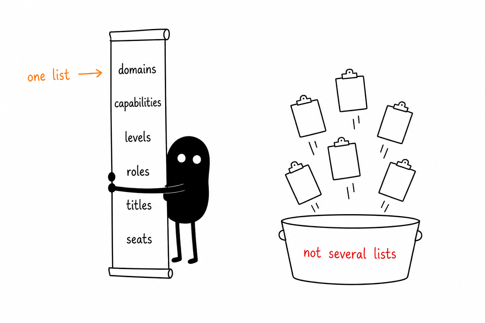
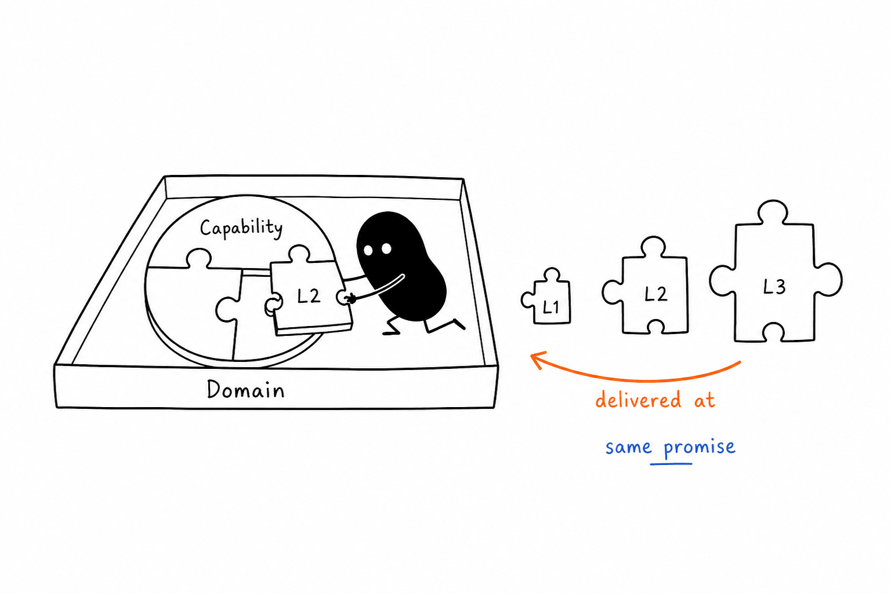
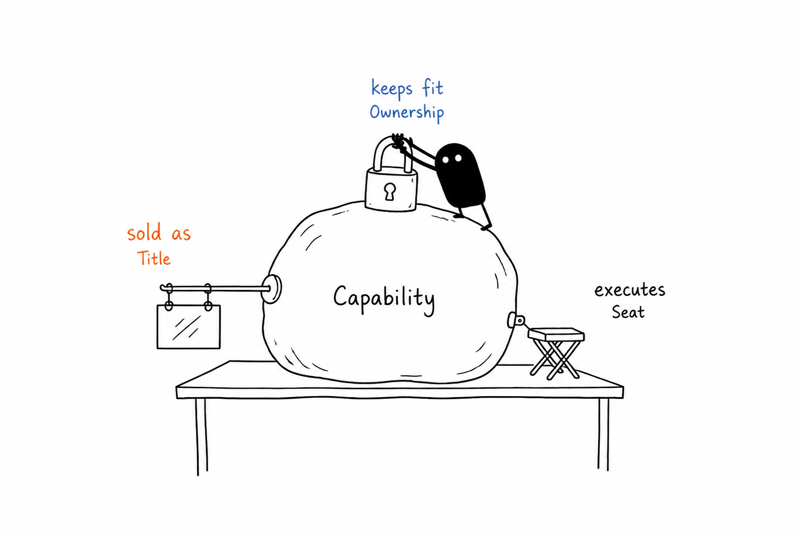
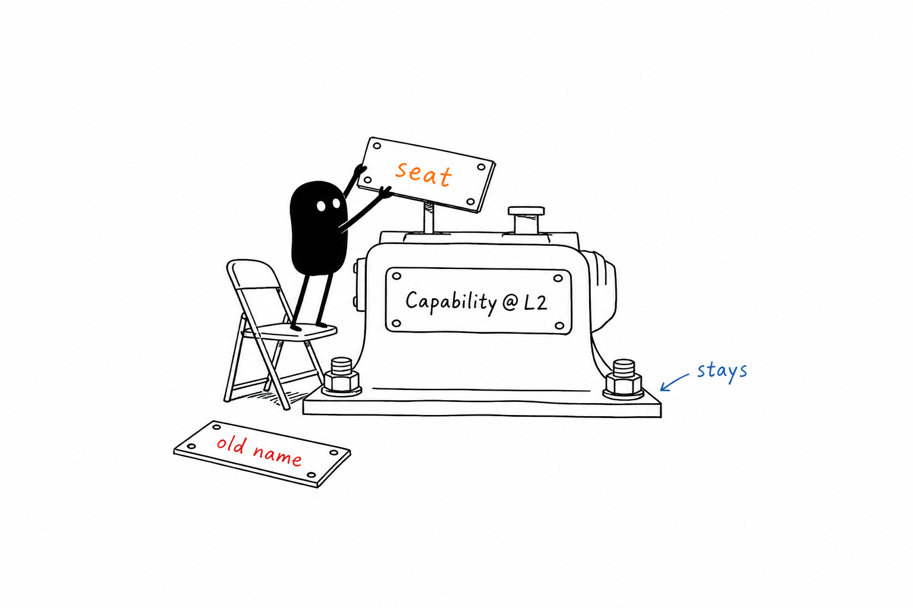
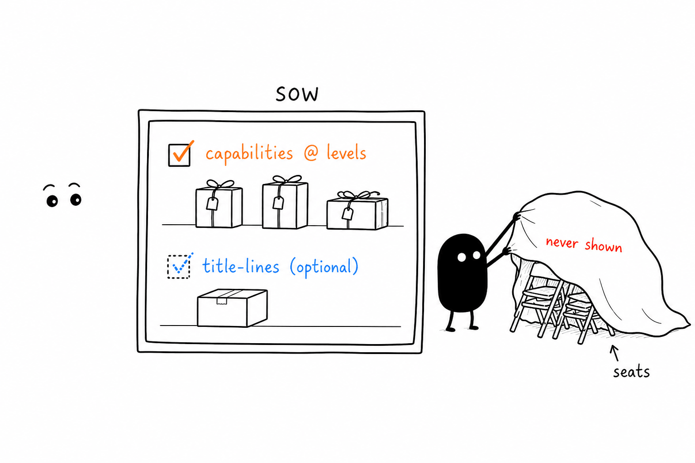

# How it all relates

The site's snapshot landing page. Published as `index.html` by `npm run build`. This file is the same argument, for editing.

The convolution comes from treating six things as six lists. There is one list. Everything else points at it.

## The spine

Domain contains capability. Capability is executed at a level (L1–L3). Domains and capabilities are fixed; capabilities carry levels. Nothing else below is its own list.

That catalog — the six domains, the named outcomes inside them, and the execution scale — is Capability Model.

## Three verbs

Title, ownership, and seat are not three more taxonomies. They are three relationships to the same capabilities. Same noun, three verbs: sold as, keeps fit, executes.

| Binding | Verb | What it points at | Scope |
|---|---|---|---|
| **Title** | sold as | a bundle of capabilities | external · coarse · stable |
| **Ownership** | keeps fit | the capabilities you author guardrails for | internal · permanent |
| **Seat** | executes | one capability at one level, this squad | internal · dynamic |

That binding lives on Roles & Titles.

## A seat is runtime

A seat is a capability-at-level with a person in it. "Eval Harness Engineer" is someone executing Validation & testing at L2 on this engagement. Ownership is a capability plus a person, permanently. Title is a bundle of capabilities plus a person, facing the market.

Seats and capabilities are not two lists to reconcile. A seat is the runtime instance of a capability-at-level. Seat names can churn without touching the capability list underneath.

The operating view is where those seats get dialed up and down by live risk, not by a phase plan.

## What the SOW shows

The contract guarantees capabilities at levels. Title-lines on the rate card are optional packaging. Seats never appear.

Client buys capabilities. The firm fulfils with people in seats. Title is the shorthand between them.

Six words that were blurring together: three of them are people-to-capability bindings, and the SOW only ever buys the capability spine. Nothing else is a list you have to maintain.

## Where to go

- Capability Model — the spine
- Roles & Titles — how people bind
- Operating View — how seats run
